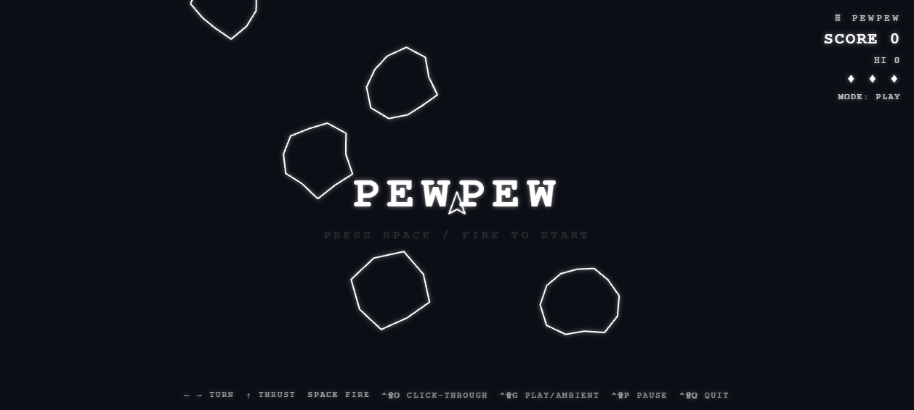

# 🚀 PewPew

A **transparent, click-through, always-on-top** desktop overlay that drops an
**8-bit white Asteroids** arcade game right on top of your screen — fly a
fighter ship, blast asteroids into smaller chunks, rack up a score… all while
your code (or anything else) keeps running **behind** it.

Flip on click-through and it becomes an ambient screensaver of drifting
asteroids floating over your editor — graphics on top, your work fully usable
underneath.


---

## ✨ Features

- **True overlay** — frameless, transparent, always-on-top window. White
  wireframe graphics float over your desktop; everything else is see-through.
- **Click-through mode** — let mouse + keyboard fall through to the apps behind
  so you can keep coding, with the game still drifting on top.
- **Two modes**
  - **PLAY** — steer the ship, thrust, fire, split asteroids, score, avoid
    collisions (3 lives).
  - **AMBIENT** — asteroids just drift across the screen, screensaver-style,
    for when you don't want to play but want the vibe.
- **8-bit white vector look** — chunky white wireframe ship & asteroids, pixel
  bullets, particle explosions. Shoot a big rock → it breaks into smaller ones.
- **Score / lives HUD** in the top-right, with a persistent high score.
- **Resizable** — drag the window edges to make the play area bigger or smaller;
  drag the `⠿ PEWPEW` grip to reposition.
- **Always a way back** — global shortcuts (work even while unfocused) plus an
  on-screen **CONTROL** handle to exit click-through, since a frameless window
  has no title bar.

| Menu | Ambient (drifting over code) |
| --- | --- |
|  |  |

---

## 🎮 Controls

| Action | Key |
| --- | --- |
| Turn left / right | `←` `→` (or `A` / `D`) |
| Thrust | `↑` (or `W`) |
| Fire | `Space` |
| Start / retry | `Space` / `Enter` |
| Toggle **click-through** | `Ctrl/Cmd + Shift + O` |
| Toggle **Play ↔ Ambient** | `Ctrl/Cmd + Shift + G` |
| Pause | `Ctrl/Cmd + Shift + P` |
| **Quit** | `Ctrl/Cmd + Shift + Q` |

> When click-through is **on**, the window ignores the mouse so clicks land on
> whatever is behind it. A small **◉ CONTROL** button stays clickable in the
> top-left — click it (or press `Ctrl/Cmd+Shift+O`) to take control back.

---

## 📦 Install & Run

You need [Node.js](https://nodejs.org) (v18+).

```bash
git clone https://github.com/LucaXav/pewpew.git
cd pewpew
npm install      # downloads Electron
npm start        # launches the overlay
```

That's it. The overlay opens on top of everything. Press `Ctrl/Cmd+Shift+Q` to
quit.

### Try the game in a plain browser (no Electron)

The renderer runs in any browser too — handy for tweaking the game:

```bash
npm run serve    # serves a test page with a fake "code" background
# open http://localhost:4173/
```

---

## 🧠 How it works

PewPew is a faithful implementation of the click-through transparent overlay
technique:

- **`main.js`** — creates a `BrowserWindow` with `transparent: true`,
  `frame: false`, `alwaysOnTop: true`, sized to the display's work area. It
  owns click-through via `win.setIgnoreMouseEvents(on, { forward: true })`
  (`forward: true` keeps mouse-move flowing to the page for hover hit-testing
  while clicks pass through), and registers the global shortcuts.
- **`preload.js`** — a tiny `contextBridge` API (`window.pew`) so the renderer
  can request click-through, get notified of changes, and quit — without
  exposing Node to the page.
- **`renderer/`** — the game. `game.js` draws white wireframes on a transparent
  `<canvas>` (cleared to alpha 0 every frame), runs the physics/collision loop,
  and handles the score HUD, modes, and the come-back handle.

The transparency only works because **every layer is transparent**: the page
background, the body, and the canvas are all alpha 0, so only the white shapes
are drawn and the desktop shows through everywhere else.

### Project layout

```
pewpew/
├── main.js            # Electron main process (window, click-through, shortcuts)
├── preload.js         # contextBridge API (window.pew)
├── renderer/
│   ├── index.html     # overlay markup (canvas + HUD + handle)
│   ├── style.css      # transparent, white, pixel-ish styling
│   └── game.js        # the Asteroids engine
├── tools/serve.js     # zero-dep static server for browser testing
├── test/index.html    # browser test harness (fake code background)
└── docs/              # screenshots
```

---

## ⚠️ Notes & gotchas

- **Frameless window has no ✕** — quit with `Ctrl/Cmd+Shift+Q`.
- **Global shortcut taken?** If a shortcut doesn't register, another app owns
  that combo; close it or change the accelerator in `main.js`.
- **Transparency on Linux** depends on a running compositor.
- Built and verified on Windows 11 with Electron 33.

---

## 📜 License

MIT © LucaXav
