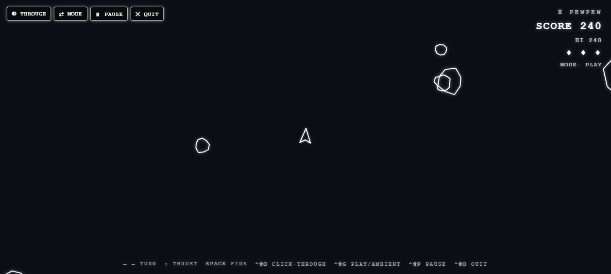
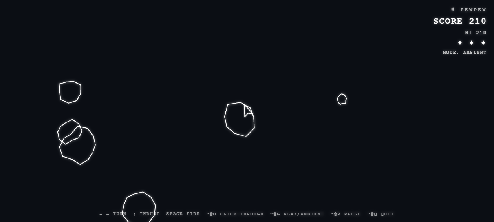

# 🛸 Vibe Shift

**An 8-bit Asteroids game that floats — transparent and click-through — right on
top of your terminal, so you can blast rocks while your AI vibecodes in the
background, then *shift* straight back to your prompt.**

You know the loop: fire off a prompt, wait for the agent to grind, fire off
another. Vibe Shift fills the wait. It drops a see-through arcade game over your
whole screen — your code stays fully readable underneath — and one hotkey
freezes the game and lets your clicks fall through to the editor so you can
retype a prompt and dive back in.



---

## ✨ What it does

- **Floats over everything** — a frameless, transparent, always-on-top window.
  Only the glowing wireframes draw; the rest is see-through, so your terminal /
  editor is fully usable behind it.
- **Reads on any background** — every shape is drawn with a contrasting outline
  *and* a glow, so the graphics pop whether they're over dark panes or bright
  white code text — without ever hiding the code.
- **Launches fullscreen on your terminal's screen** — it opens covering the
  display your cursor is on, snug to the work area. Double-click anywhere to
  pop to a window; double-click again to snap back to fullscreen.
- **Shift to focus, shift back** — one hotkey (`Ctrl+Shift+F`) **pauses the game
  and turns on click-through** so you can type your next prompt into your editor
  *through* the overlay. Hit it again and you're back in the game, exactly where
  you left off. A flash at the top always reminds you of the key.
- **Actual gameplay, not just a screensaver:**
  - **Levels** — clear every asteroid to advance; each level adds more rocks and
    speeds them up.
  - **Power-ups** (drawn as real icons): 🛡 shield, three-shot **triple**,
    ⚡ **rapid-fire**, and a ♥ **extra life**. Fly over one to grab it.
  - **A chasing mini-boss** — a hunter that hunts you down, fires back, takes
    several hits, and drops a power-up when you kill it.
  - **Reverse thrust** — back up with `↓` / `S`, not just forward.
- **Ambient mode** — flip to a calm screensaver of drifting rocks when you'd
  rather just vibe.
- **Color themes** — White → Retro CRT Green → Amber → Cyan → **Auto** (samples
  the desktop behind the window and picks a contrasting color so the graphics
  always stay visible).

| Ambient drift over code | Retro CRT green |
| --- | --- |
|  |  |

---

## 📦 Install & run

You need [Node.js](https://nodejs.org) (v18+). Then:

```bash
git clone https://github.com/LucaXav/vibeshift.git
cd vibeshift
npm install      # downloads Electron + generates the app icon
npm start        # launches the overlay, fullscreen, on top of everything
```

That's it — it opens fullscreen over whatever's on your screen. The window is
transparent, so you'll see glowing wireframes floating over your desktop with
the control icons (and a key hint) in the **top-left corner**. Quit any time
with **`Ctrl+Shift+Q`**.

### Desktop icon + global launch hotkey (Windows)

```bash
npm run install-desktop
```

Creates a **Vibeshift** icon on your Desktop and Start Menu (with the app logo)
and binds it to **`Ctrl+Shift+F7`** — press that anywhere to launch it (or bring
it to the front if it's already running).

### A global `vibeshift` command

```bash
npm install -g .     # (or: npm link)
vibeshift            # launch from anywhere
```

### Try it in a plain browser (no Electron)

```bash
npm run serve        # then open http://localhost:4173/
```

---

## 🎮 Controls

| Action | Key |
| --- | --- |
| Turn left / right | `←` `→` (or `A` / `D`) |
| Forward thrust | `↑` (or `W`) |
| **Reverse thrust** | `↓` (or `S`) |
| Fire | `Space` |
| Start / retry | `Space` / `Enter` |
| **Focus & pause** (type behind the overlay) | `Ctrl+Shift+F` |
| Pause | `Ctrl+Shift+P` |
| Toggle **click-through** | `Ctrl+Shift+O` |
| Toggle **Play ↔ Ambient** | `Ctrl+Shift+G` |
| Change color | `Ctrl+Shift+C` |
| Quit | `Ctrl+Shift+Q` |

> On macOS, `Ctrl` is `Cmd` in these combos. Each shortcut tries a few fallback
> combos if another app already owns one, and every action also has an on-screen
> icon button (top-left), so nothing is ever truly stuck.

### The vibecoding flow

1. You're playing while the agent works.
2. Agent stops, you need to prompt again → hit **`Ctrl+Shift+F`**. The game
   freezes and your mouse/keyboard pass straight through to your editor.
3. Type your prompt, hit enter.
4. Hit **`Ctrl+Shift+F`** again → back in the game, right where you left off.

### Moving, resizing, fullscreen

- **Fullscreen:** **double-click anywhere** to toggle. It already launches
  fullscreen on the screen your cursor is on.
- **Move:** click-drag anywhere on the surface (it's all a drag handle).
- **Resize:** drag any of the 8 grips on the dashed outline that traces the
  window edge.
- **Controls** (top-left icons: ✕ quit · ◐ click-through · ⇄ play/ambient ·
  ⏸ pause · ⬤ color) auto-hide when idle — nudge the mouse into the top-left
  corner to bring them back.

---

## 🧠 How it works

A transparent, click-through, always-on-top overlay done the standard way:

- **`main.js`** — creates a `BrowserWindow` with `transparent: true`,
  `frame: false`, `alwaysOnTop: true`, sized to the work area of the display the
  cursor is on. Owns click-through via
  `win.setIgnoreMouseEvents(on, { forward: true })` (forwarding keeps mouse-move
  flowing for hover hit-testing while clicks pass through), fullscreen toggling,
  and the global shortcuts.
- **`preload.js`** — a tiny `contextBridge` API (`window.pew`) so the renderer
  can request click-through / focus / fullscreen and get notified of changes,
  without exposing Node to the page.
- **`renderer/`** — the game, as focused ES modules under `src/`. They draw
  glowing wireframes on a transparent `<canvas>` (cleared to alpha 0 every
  frame), run the physics/collision loop, and own the HUD, modes, themes, and
  the auto-hiding chrome.

Transparency only works because **every layer is transparent** — the page, the
body, and the canvas are all alpha 0, so only the wireframes draw and your work
shows through everywhere else.

### Project layout

```
vibeshift/
├── main.js                  # Electron main (window, click-through, fullscreen, shortcuts)
├── preload.js               # contextBridge API (window.pew)
├── bin/vibeshift.js         # `vibeshift` CLI launcher
├── renderer/
│   ├── index.html           # overlay markup (canvas + drag surface + HUD + controls)
│   ├── style.css            # transparent, glowing, pixel-ish styling
│   └── src/                 # the game, as focused ES modules
│       ├── main.js          # entry: boots modules, runs the loop, wires IPC
│       ├── config.js        # tunable constants + lookup tables
│       ├── bridge.js        # the window.pew Electron bridge (or null in a browser)
│       ├── view.js          # transparent canvas + DPR-aware sizing
│       ├── utils.js         # rand/randi + toroidal screen wrap
│       ├── state.js         # the shared mutable game state
│       ├── entities.js      # ship / asteroid / power-up / boss / particle factories
│       ├── hud.js           # score-lives DOM overlay, banner, command flash, +N pops
│       ├── engine.js        # lifecycle, input, physics + collision update
│       ├── render.js        # draws the scene each frame (with contrast outlines)
│       ├── themes.js        # color themes + auto background sampling
│       └── chrome.js        # auto-hide controls, move/resize, fullscreen, focus mode
├── assets/                  # generated app icon (vibeshift.png / vibeshift.ico)
├── tools/                   # static server, icon generator, desktop-shortcut installer
├── test/index.html          # browser test harness (fake code background)
└── docs/                    # screenshots
```

---

## ⚠️ Notes

- **Frameless window has no ✕** — quit with `Ctrl+Shift+Q` (or the top-left ✕).
- **A shortcut didn't bind?** Another app owns that combo — use the on-screen
  icons, or change the accelerator in `main.js`.
- **Transparency on Linux** needs a running compositor.
- Built and verified on Windows 11 with Electron 33.

---

## 📜 License

MIT © LucaXav
